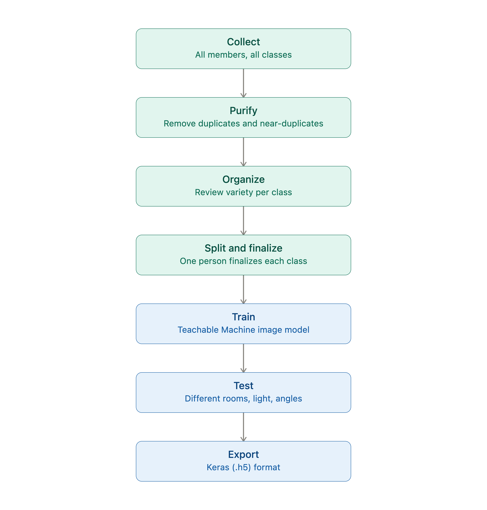
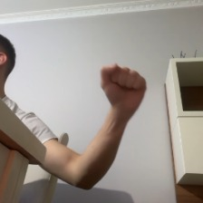
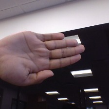
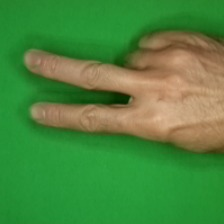

# rock-paper-scissors-ml

## Project Overview

This project explores how an image classification model can distinguish
between three hand gestures: Rock, Paper, and Scissors.

The project covers the complete workflow of collecting and preparing image
data, training an image classification model using Google's Teachable
Machine, and testing the model under different conditions.

The main goal was not only to train a model that recognizes the three
gestures, but also to investigate how factors such as lighting, background,
framing, and hand appearance can influence its predictions.

## Dataset & Training Methodology

### Team

This project was built by a team of three:

- Gjergji
- Reina
- Sejbi

### Data Statement

Our dataset contains images of hands showing three gestures: rock, paper,
and scissors. The dataset combines photographs taken by the three team
members using our phones with additional images obtained from online
datasets and Google Images.

The photographs taken by the team show our own hands, and we are
comfortable with these images being published in this project repository.
We reviewed the team-generated photographs to avoid including faces or
other unnecessary personally identifiable information.

The final dataset and exported model are stored in this project repository.

### Data Sources

The final dataset combines images from multiple sources:

- **Team-generated photographs:** Images taken by the three team members
  using our phones, showing our own hands making the target gestures.

- **Online datasets:** Additional images obtained from publicly available
  image datasets.

- **Google Images:** Additional images collected through Google Images to
  increase visual variety.

The external sources were used to increase the diversity of poses,
backgrounds, lighting conditions, and hand appearances in the dataset.

Where available, the original sources of external images are documented
separately.

### Data Diversity

To reduce dependence on a single visual environment, the dataset includes
variation in:

- **Lighting:** different brightness levels and indoor lighting conditions.
- **Backgrounds:** different surrounding environments and surfaces.
- **Angles:** different hand orientations and camera angles.
- **Framing:** different distances and positions of the hand within the image.
- **People:** photographs from the team members and images from external
  sources with different hand appearances.

This variety was intended to reduce the risk of the model learning
environment-specific patterns instead of the intended hand gestures.

### Project Timeline

The project ran over four days:

- **Day 1 — Kickoff.** Since we don't have Slack, we set up a WhatsApp
  group and used it as our main communication channel for the rest of
  the project. This day was planning only — no data collection yet.

- **Day 2 — Collect.** All three of us contributed to the dataset
  collection. We combined photographs taken by the team with additional
  images obtained from online datasets and Google Images, then ran an
  initial pass to remove duplicates.

- **Day 3 — Train.** We organized the pool by variety, split the final
  selection work by class, and trained the model in Teachable Machine.

- **Day 4 — Ship.** We tested the model across different rooms, lighting
  conditions, and framing, then exported the final model and wrote up
  this documentation.

### Why We Didn't Just Split the Classes From the Start

An obvious way to split the data-gathering work three ways is to assign
each person one class and have them go collect images for it independently.
We deliberately avoided this.

The problem: if one person exclusively gathers "paper" photos and happens
to shoot them in a dim room, while another person exclusively gathers "rock"
photos in a bright room, the model doesn't just learn the shape of a fist
vs. an open hand — it also picks up on the *environment* each class was
photographed in. Lighting, background, and room become accidentally
correlated with the class label. The model can end up learning "dark = paper,
bright = rock" instead of the actual hand shape, which falls apart the
moment it's tested somewhere new.

### Our Actual Process

1. **Collect and combine the data.** All three of us contributed to the
   dataset collection. We combined team-generated photographs with images
   from online datasets and Google Images into one shared pool before the
   final class selection.

2. **Purify the pool.** We reviewed the combined dataset for duplicate and
   near-duplicate images, using Claude as an assistance tool during the
   review, to remove redundant or near-identical shots that could
   over-represent a specific pose or setting.

3. **Organize by variety.** The cleaned dataset was reviewed for variety
   across angle, background, and lighting, so we could see what range of
   conditions we actually had before selecting a final training set.

4. **Then divide the work.** Only after the pool was purified and
   organized did we split up the job of picking the *best* images per
   class — Gjergji finalized rock, Reina finalized scissors, Sejbi
   finalized paper — with each of us aiming to preserve the same variety
   (lighting, background, angle) across all three classes, since the
   raw material was already shared and balanced.

5. **Train.** The final dataset was used to train the image classification
   model in Google's Teachable Machine.

6. **Test across conditions.** We tested the trained model manually
   across a range of real-world conditions — different rooms, lighting
   levels, and aspect ratios/framing — rather than just testing on
   clean, ideal shots.

7. **Export.** The final model was exported in Keras (`.h5`) format.

### Dataset Summary

| Class | Finalized by | Image count |
|----------|--------------|-------------|
| Rock | Gjergji | 200 |
| Paper | Sejbi | 200 |
| Scissors | Reina | 200 |

The final dataset contains **600 images**, with **200 images per class**.

The dataset is balanced across the three target classes.

### Sample Images

**Rock**

**Paper**

**Scissors**

### Training

The final dataset was used to train a three-class image classification
model using Google's Teachable Machine.

The three classes were:

- Rock
- Paper
- Scissors

Each class contained 200 images, for a total of 600 training images.

The training process used Teachable Machine's image classification
workflow. After training, the final model was exported in Keras (`.h5`)
format.

### Internal Testing

After training, we tested the model manually using the Teachable Machine
preview interface.

We tested the model under different conditions, including:

- different lighting levels;
- different backgrounds;
- different rooms;
- different camera angles;
- different distances and framing;
- Rock, Paper, and Scissors gestures;
- inputs outside the three target classes.

The purpose of this testing was to observe whether the model's predictions
remained stable when the visual conditions changed.

### Internal Testing

After training, we tested the model manually using the Teachable Machine
preview interface.

We tested the model under different conditions, including:

- different lighting levels;
- different backgrounds;
- different rooms;
- different camera angles;
- different distances and framing;
- Rock, Paper, and Scissors gestures;
- inputs outside the three target classes.

For each class, we selected three test examples showing different
combinations of camera angles and lighting conditions. These examples are
included in the repository and are used to demonstrate the conditions under
which the model was tested.

The purpose of this testing was to observe whether the model's predictions
remained stable when the visual conditions changed.

### Test Examples

The following examples show three tests for each of the three target
classes. The images demonstrate variations in camera angle, lighting, and
framing.

**Rock**

**Paper**

**Scissors**

These examples provide a visual representation of the testing process and
show how the model was evaluated under conditions different from the
original training images.

### Known Limitations

- The model always predicts one of the three target classes — there is no
  "unknown/other" class, so an image of anything else will still be forced
  into one of the three categories.

- The model may perform differently when it encounters lighting,
  backgrounds, angles, or framing conditions that are not well represented
  in the training data.

- The dataset contains 600 images, which limits the number of people and
  environments represented in the training data.

- The external images may have different visual characteristics from the
  photographs taken by the team.

### Conclusion

This project demonstrates the complete workflow of building a small image
classification system, from dataset collection and preparation to model
training and testing.

The project also focuses on how dataset diversity can affect model
behavior. By introducing variation in lighting, backgrounds, angles,
framing, and hand appearance, we aimed to reduce the risk of the model
learning environment-specific patterns instead of the intended gestures.

Further evaluation on previously unseen images will be used to analyze the
model's generalization and identify potential failure patterns.
