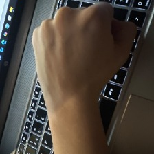
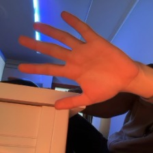
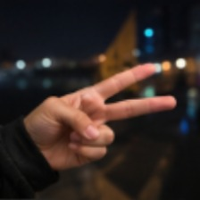

# rock-paper-scissors-ml

## Dataset & Training Methodology

### Team
This project was built by a team of three:
- Gjergji — Rock
- Reina — Scissors
- Sejbi — Paper

### Project timeline

The project ran over four days:

- **Day 1 — Kickoff.** Since we don't have Slack, we set up a WhatsApp
  group and used it as our main communication channel for the rest of
  the project. This day was planning only — no data collection yet.
- **Day 2 — Collect.** All three of us gathered raw rock/paper/scissors
  images together and ran an initial pass to remove duplicates.
- **Day 3 — Train.** We organized the pool by variety, split the final
  selection work by class, and trained the model in Teachable Machine.
- **Day 4 — Ship.** We tested the model across different rooms, lighting
  conditions, and framing, then exported the final model and wrote up
  this documentation.

### Why we didn't just split the classes from the start

An obvious way to split the data-gathering work three ways is to assign
each person one class and have them go collect images for it independently.
We deliberately avoided this.

The problem: if one person exclusively gathers "paper" photos and happens
to shoot them in a dim room, while another person exclusively gathers "rock"
photos in a bright room, the model doesn't just learn the shape of a fist
vs. an open hand — it also picks up on the *environment* each class was
photographed in. Lighting, background, and room become accidentally
correlated with the class label. The model can end up learning "dark = paper,
bright = rock" instead of the actual hand shape, which falls apart the
moment it's tested somewhere new.

### Our actual process

1. **Collect together, not separately.** All three of us gathered raw
   images for all three classes together first, combining everything
   into one shared pool before any class-specific work began — this way no
   single class was tied to one person's lighting, room, or camera.

2. **Purify the pool.** We ran the combined dataset through a duplicate
   and near-duplicate check (using Claude) to remove redundant or
   near-identical shots that would have over-represented a specific pose
   or setting.

3. **Organize by variety.** The cleaned dataset was reviewed for variety
   across angle, background, and lighting, so we could see what range of
   conditions we actually had before selecting a final training set.

4. **Then divide the work.** Only after the pool was purified and
   organized did we split up the job of picking the *best* images per
   class — Gjergji finalized rock, Reina finalized scissors, Sejbi
   finalized paper — with each of us aiming to preserve the same variety
   (lighting, background, angle) across all three classes, since the
   raw material was already shared and balanced.

5. **Train.** Images were used to train an image classification model
   in Google's Teachable Machine.

6. **Test across conditions.** We tested the trained model manually
   across a range of real-world conditions — different rooms, lighting
   levels, and aspect ratios/framing — rather than just testing on
   clean, ideal shots.

7. **Export.** The final model was exported in Keras (`.h5`) format.

### Dataset summary

| Class    | Finalized by | Image count |
|----------|--------------|-------------|
| Rock     | Gjergji      | 100         |
| Paper    | Sejbi        | 100         |
| Scissors | Reina        | 100         |

All 300 images are real photos taken by the team (no synthetic or stock
images in the final training set).

### Sample images

**Rock**

**Paper**

**Scissors**

### Known limitations

The model always predicts one of the three classes — there is no
"unknown/other" class, so an image of anything else will still be forced
into one of the three categories.
